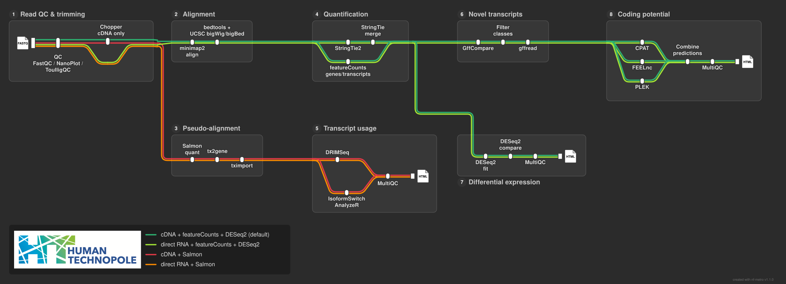

# nfdata-omics/nanotranseq

[](https://github.com/codespaces/new/nfdata-omics/nanotranseq)
[](https://github.com/nfdata-omics/nanotranseq/actions/workflows/nf-test.yml)
[](https://github.com/nfdata-omics/nanotranseq/actions/workflows/linting.yml)[](https://doi.org/10.5281/zenodo.XXXXXXX)
[](https://www.nf-test.com)

[](https://www.nextflow.io/)
[](https://github.com/nf-core/tools/releases/tag/4.0.2)
[](https://docs.conda.io/en/latest/)
[](https://www.docker.com/)
[](https://sylabs.io/docs/)
[](https://cloud.seqera.io/launch?pipeline=https://github.com/nfdata-omics/nanotranseq)

## Introduction

**nfdata-omics/nanotranseq** is a Nextflow pipeline for **Oxford Nanopore long-read RNA sequencing** (direct RNA and cDNA). It takes basecalled FASTQ reads and a reference genome + annotation.



- Long-read QC reports (NanoPlot, toulligQC, FastQC, MultiQC)
- Spliced genome alignments (minimap2) and genome-browser tracks (BigWig)
- Reference-guided transcript assembly (StringTie2)
- Novel transcript and novel isoform discovery (gffcompare)
- Coding-potential classification of novel transcripts / lncRNA calling (CPAT, FEELnc, PLEK consensus)
- Gene- and transcript-level quantification (featureCounts and/or Salmon)
- Differential gene expression (DESeq2)
- Differential transcript usage / isoform switching (DRIMSeq or DEXSeq + IsoformSwitchAnalyzeR)

## Pipeline steps

1. **Read QC** — NanoPlot, toulligQC, FastQC → MultiQC (`RAW_READS_QC`)
2. **Trimming** — Chopper, cDNA only (`DIRECT_RNA_QC`, skipped when `--direct_rna`)
3. **Alignment** — minimap2 spliced alignment → sorted BAM (`ALIGNMENT`); optional GPU via Parabricks
4. **Coverage tracks** — bedtools + UCSC tools → BigWig (`BEDTOOLS_BIGWIG`)
5. **Assembly + counting** — StringTie2 (long-read mode) → StringTie merge → featureCounts (`STRINGTIE_FEATURECOUNTS`)
6. **Novel transcripts** — gffcompare vs reference, filter by class code → extract sequences (`NOVEL_TRANSCRIPTS`)
7. **Coding potential** — CPAT + FEELnc + PLEK consensus, optional (`IDENTIFY_NOVEL_PROTEIN_CODING`, `--run_coding_potential`)
8. **Differential expression** — DESeq2 (`DIFFERENTIAL_ANALYSIS`)
9. **Pseudo-quantification** — Salmon → tximport (`PSEUDOALIGNMENT`, when `--quantification_tool salmon|both`)
10. **Transcript usage** — DRIMSeq/DEXSeq + IsoformSwitchAnalyzeR (`TRANSCRIPT_USAGE`)

## Usage

```bash
nextflow run nfdata-omics/nanotranseq \
   -profile <docker/singularity> \
   --input samplesheet.csv \
   --fasta genome.fa \
   --gtf annotation.gtf \
   --outdir results
```

Samplesheet (`--input`):

```csv
sample,fastq,condition
CTRL_REP1,ctrl1.fastq.gz,control
TREAT_REP1,treat1.fastq.gz,treated
```

Key parameters:

| Param                                                                 | Default         | Notes                                        |
| --------------------------------------------------------------------- | --------------- | -------------------------------------------- |
| `--direct_rna`                                                        | `false`         | `true` = direct RNA (skips Chopper trimming) |
| `--quantification_tool`                                               | `featurecounts` | `featurecounts` \| `salmon` \| `both`        |
| `--novel_class_codes`                                                 | `u,i,x,j,o`     | gffcompare classes kept as novel             |
| `--run_coding_potential`                                              | `true`          | enable CPAT/FEELnc/PLEK                      |
| `--dtu_tool`                                                          | `drimseq`       | `drimseq` \| `dexseq`                        |
| `--deseq2_formula` / `--deseq2_comparison` / `--deseq2_fdr_threshold` | —               | DE design                                    |

## Credits

nfdata-omics/nanotranseq was originally written by Karla Alejandra Ruiz Ceja, Leandro Tiburske and Matteo Bonfanti.

## Contributions and Support

If you would like to contribute to this pipeline, please see the [contributing guidelines](docs/CONTRIBUTING.md).

## Citations

<!-- TODO nf-core: Add citation for pipeline after first release. Uncomment lines below and update Zenodo doi and badge at the top of this file. -->
<!-- If you use nfdata-omics/nanotranseq for your analysis, please cite it using the following doi: [10.5281/zenodo.XXXXXX](https://doi.org/10.5281/zenodo.XXXXXX) -->

If you use this pipeline, please cite the pipeline framework and the tools used in the analysis, including Nextflow, nf-core, NanoPlot, ToulligQC, FastQC, MultiQC, Chopper, minimap2, bedtools, UCSC utilities, StringTie, gffcompare, gffread, CPAT, FEELnc, PLEK, featureCounts/Subread, Salmon, tximport/tximeta, DESeq2, DRIMSeq, DEXSeq and IsoformSwitchAnalyzeR, as applicable to the workflow options enabled in your run. Please also cite the reference genome assembly, transcript annotation and any CPAT training data or pre-built coding-potential models used for the analysis.

An extensive list of references for the tools used by the pipeline can be found in the [`CITATIONS.md`](CITATIONS.md) file.

This pipeline uses code and infrastructure developed and maintained by the [nf-core](https://nf-co.re) community, reused here under the [MIT license](https://github.com/nf-core/tools/blob/main/LICENSE).

> **The nf-core framework for community-curated bioinformatics pipelines.**
>
> Philip Ewels, Alexander Peltzer, Sven Fillinger, Harshil Patel, Johannes Alneberg, Andreas Wilm, Maxime Ulysse Garcia, Paolo Di Tommaso & Sven Nahnsen.
>
> _Nat Biotechnol._ 2020 Feb 13. doi: [10.1038/s41587-020-0439-x](https://dx.doi.org/10.1038/s41587-020-0439-x).
